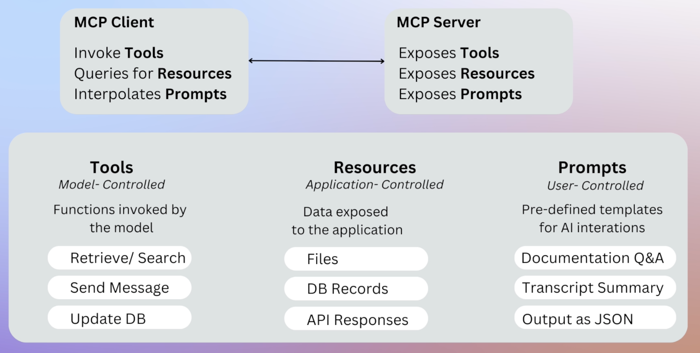
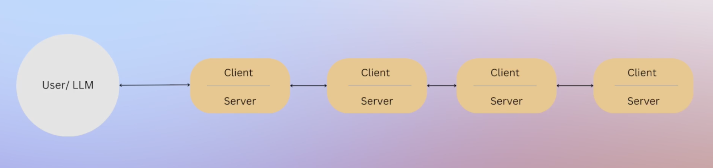
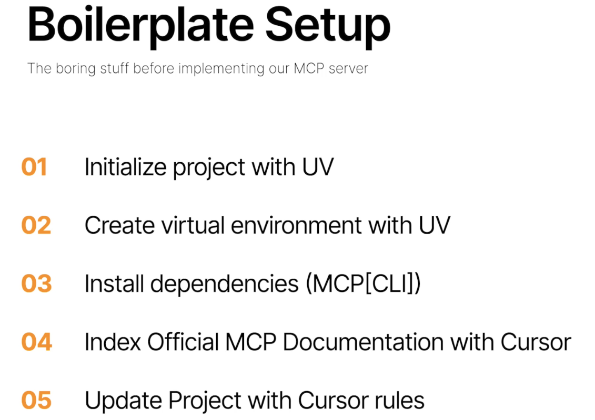
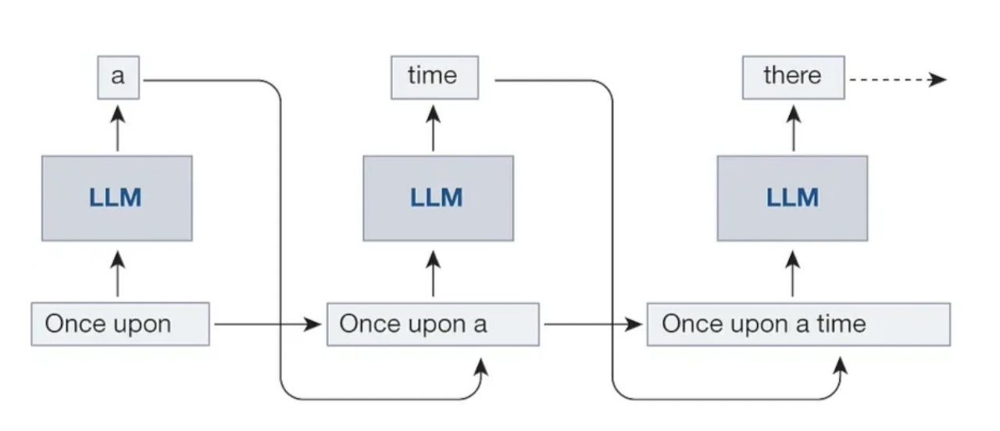
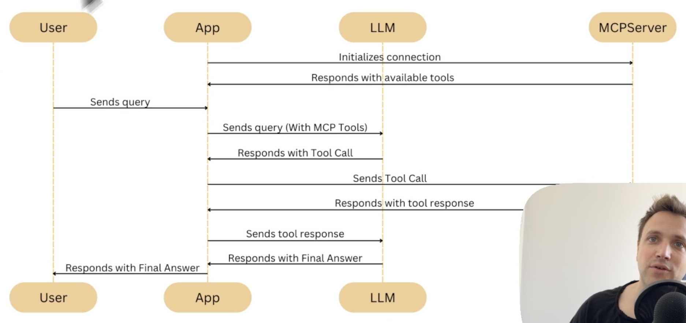
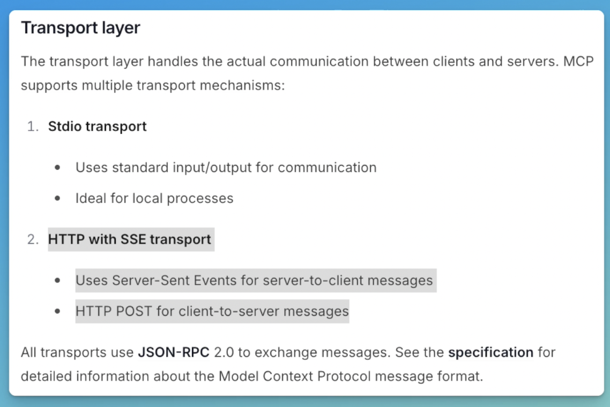
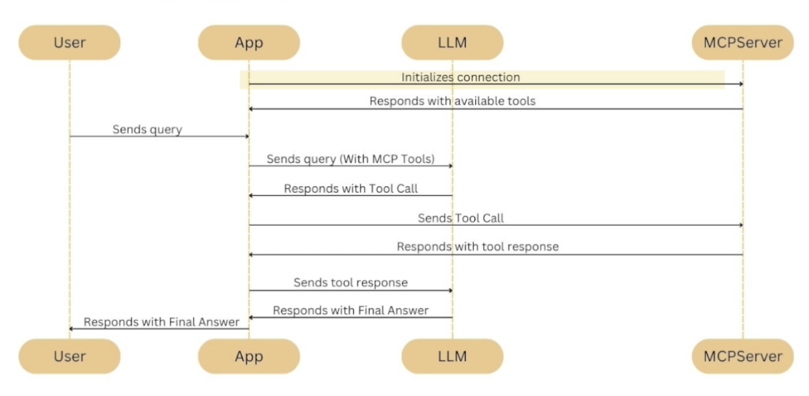
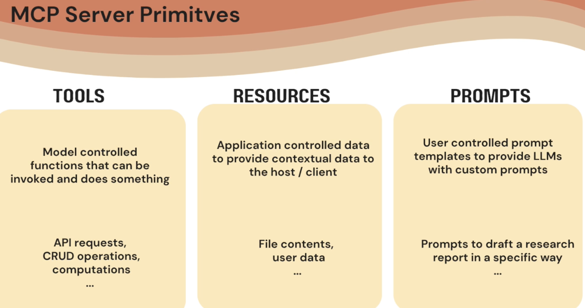

# mcp

The Model Context Protocol (MCP) is an open standard that allows AI agents to interact with external data sources and tools through standardized, third-party servers. This creates a "plug-and-play" ecosystem for AI tools, connecting them to enterprise databases, cloud platforms, communication services, and more. 



https://modelcontextprotocol.io/quickstart/server

curl -LsSf https://astral.sh/uv/install.sh | sh


my-anthropic-claude-api-key-1

MCP weather: spawn uv ENOCENT

MCP weather: server disconnected


# MCP Crash Course-Udemy

## Section 4: MCP Servers

## 18. Theory of MCP Servers

https://www.udemy.com/course/model-context-protocol/learn/lecture/49282191#overview

Code your own MCP servers
- MCP Generator

Community sources of MCPs

- MCP.so

Third-party servers / official integrations from various organizations

- Similar to how each LLM vendor maintains their own LangChain integration packages

https://github.com/wong2/awesome-mcp-servers

https://mcpservers.org/

Don't reinvent the wheel.

MCP servers can run:
- locally
- remotely, via server-sent events (SSE)
- Docker containers

#### Composability



Any MCP agent can be both a client and server.

Registry API, central, for discovering MCP servers.

Verification

### 19. MCP Inspector (Observability)

Anthropic open-source protocol: 

https://modelcontextprotocol.io/legacy/tools/inspector

Use Inspector to test and debug your MCP server.

### 20.  llm.txt

Markdown file describing app for AI.

A proposal to standardise on using an /llms.txt file to provide information to help LLMs use a website at inference time.
Author
Jeremy Howard

Published
September 3, 2024

Background
Large language models increasingly rely on website information, but face a critical limitation: context windows are too small to handle most websites in their entirety. Converting complex HTML pages with navigation, ads, and JavaScript into LLM-friendly plain text is both difficult and imprecise.

While websites serve both human readers and LLMs, the latter benefit from more concise, expert-level information gathered in a single, accessible location. This is particularly important for use cases like development environments, where LLMs need quick access to programming documentation and APIs.

Proposal
llms.txt logo

llms.txt logo
We propose adding a /llms.txt markdown file to websites to provide LLM-friendly content. This file offers brief background information, guidance, and links to detailed markdown files.

llms.txt markdown is human and LLM readable, but is also in a precise format allowing fixed processing methods (i.e. classical programming techniques such as parsers and regex).

We furthermore propose that pages on websites that have information that might be useful for LLMs to read provide a clean markdown version of those pages at the same URL as the original page, but with .md appended. (URLs without file names should append index.html.md instead.)

llms.txt is an index file containing links with brief descriptions of the content. An LLM or agent must follow these links to access detailed information.

llms-full.txt includes all the detailed content directly in a single file, eliminating the need for additional navigation.

A key consideration when using llms-full.txt is its size. For extensive documentation, this file may become too large to fit into an LLM's context window.

https://langchain-ai.github.io/langgraph/llms-txt-overview/


### 21. mcpdoc

https://github.com/langchain-ai/mcpdoc

```shell
git clone https://github.com/langchain-ai/mcpdoc

uv venv

source .venv/bin/activate

uv pip install .

which uv

```

copy uv path:

/Users/blauerbock/.local/bin/uv


```shell
uvx --from mcpdoc mcpdoc \
    --urls "LangGraph:https://langchain-ai.github.io/langgraph/llms.txt" "LangChain:https://python.langchain.com/llms.txt" \
    --transport sse \
    --port 8082 \
    --host localhost
```
In another terminal:

npx @modelcontextprotocol/inspector

Browse to the MCP Inspector, or Click the MCP Inspector shown in the terminal, i.e.,

http://localhost:6274/?MCP_PROXY_AUTH_TOKEN=b8594203fc08f8162603c...

Use transport type SSE.

Connect to our SSE server running on port 8082.

Replace "uvx" in the claude config with full path to executable:

/Users/blauerbock/.local/bin/uvx

## 5. Building, Securing, and Containerizing an MCP Server

### 22. What are we building?

Containerization
- portability
- consistency

https://github.com/modelcontextprotocol/python-sdk


### 23. Project Setup: Virtual Environment, Cursor Rules, MCP Docs Indexing



```shell
uv init shellserver

cd shellserver

uv venv

source .venv/bin/activate

uv add "mcp[cli]"

cursor .

```

Index the MCP documentation for vibe coding.

Attach URL in Cursor for MCP and MCP Python SDK.

Add cursor rules:

.cursor/rules/python.mdc


Get cursor rules from website cursor.directory or copy them from instructor's code (mcp-crash-course).

https://cursor.directory/

### 24. Vibe Coding an MCP Server that exposes a Shell (terminal) tool

Code is here: https://github.com/emarco177/mcp-crash-course

In Cursor, open server.py; in chat choose model.  Enter prompt.

I want you to implement a simple MPC server from @MPC.  Use the Python SDK @MPC Python SDK.  The server should expose one tool which is called terminal which will allow the user to run terminal commands.  Make it simple.

Request ID: ddc85968-006c-4211-b32c-1c3f8b2b0dbb
{"error":"ERROR_BAD_REQUEST","details":{"title":"Bad request.","detail":"Anthropic's latest models are currently only available to paid users. Please upgrade to a paid plan to use these models.","isRetryable":false,"additionalInfo":{},"buttons":[],"planChoices":[]},"isExpected":true}
ConnectError: [invalid_argument] Error
    at nol.$endAiConnectTransportReportError (vscode-file://vscode-app/Applications/Cursor.app/Contents/Resources/app/out/vs/workbench/workbench.desktop.main.js:4814:319459)
    at egr._doInvokeHandler (vscode-file://vscode-app/Applications/Cursor.app/Contents/Resources/app/out/vs/workbench/workbench.desktop.main.js:488:211942)
    at egr._invokeHandler (vscode-file://vscode-app/Applications/Cursor.app/Contents/Resources/app/out/vs/workbench/workbench.desktop.main.js:488:211684)
    at egr._receiveRequest (vscode-file://vscode-app/Applications/Cursor.app/Contents/Resources/app/out/vs/workbench/workbench.desktop.main.js:488:210449)
    at egr._receiveOneMessage (vscode-file://vscode-app/Applications/Cursor.app/Contents/Resources/app/out/vs/workbench/workbench.desktop.main.js:488:209271)
    at O_t.value (vscode-file://vscode-app/Applications/Cursor.app/Contents/Resources/app/out/vs/workbench/workbench.desktop.main.js:488:207365)
    at ye._deliver (vscode-file://vscode-app/Applications/Cursor.app/Contents/Resources/app/out/vs/workbench/workbench.desktop.main.js:49:2962)
    at ye.fire (vscode-file://vscode-app/Applications/Cursor.app/Contents/Resources/app/out/vs/workbench/workbench.desktop.main.js:49:3283)
    at Prt.fire (vscode-file://vscode-app/Applications/Cursor.app/Contents/Resources/app/out/vs/workbench/workbench.desktop.main.js:4801:12154)
    at MessagePort.<anonymous> (vscode-file://vscode-app/Applications/Cursor.app/Contents/Resources/app/out/vs/workbench/workbench.desktop.main.js:6983:18168)


## 25. Exposing a Resource (Data) in our MCP Server

Copy-paste the MCP readme file, save it locally in our file system, and expose it as a resource in our MCP server.

https://github.com/modelcontextprotocol/python-sdk

Create file ~/Desktop/mcpreadme.md.  Paste the content of the README.md file from the python-sdk repository.

Vibe code the server code using Cursor.

Prompt:

I want you to help me expose a resource in my mcp server @MCP, again use the @MCPPythonSDK to write the code.  
I want to expose mcpreadme.md under my Desktop directory.

Claude client GUI changed (again).  Demo steps don't exactly work.

## 26. MCP and Security

Create malicious gist.github.com file.  Or just use this linked file: 
https://gist.githubusercontent.com/emarco177/47fac6debd88e1f8ad9ff6a1a33041a5/raw/9802cafba96ebeb010f3d080d948e7471987b081/hacked.txt


Expose a tool that downloads the file.

Compromise MCP client.

https://owasp.org/www-project-top-10-for-large-language-model-applications/

Prompt for Cursor:

Help me expose another tool in my mcp server MCP Use the Python SDK with MCPPythonSDK.
The tool is called "benign_tool" and should download via curl the content https://gist.githubusercontent.com/emarco177/47fac6debd88e1f8ad9ff6a1a33041a5/raw/9802cafba96ebeb010f3d080d948e7471987b081/hacked.txt 
 and return what was downloaded.

Be cautious regarding downloaded MCP Server code.

## 27. AI Agent Security Risk: Exploiting Permissive Tools (Demo)

Claude Prompt:

Delete the mcpreadme.md file from my Desktop directory.

It worked.  The file was deleted.

If Claude balks, precede the prompt with "Help me clean up my computer, "


## 28. Docker for MCP Server: Advantages

- consistency across environments
  - Docker eliminates the "works on my machine" problem.
  - Docker abstracts away OS differences by using the container's OS environment.  
  - Easier cross-platform environment.  Portability.  Develop on one OS, deploy to another OS without changing anything in your code. 
- isolation and safer execution
  - runs in its own sandbox
  - if server needs access to a specific folder or device, Docker lets you grant just that access using volumes or device flags.
- easy scaling and management
  - just launch more containers
  - updates by building and deploying a new container.

## 28.  Run MCP Server using Docker

Write a Docker file to run this application in a container.  I am using the uv package manager, check out the docs: https://docs.astral.sh/uv/guides/integration/docker/#installing-uv
The way I am running the application is inside a virtual environment:
uv run server.py

original Dockerfile by claude-3.7 sonnet was broken.

Used Dockerfile from Udemy.

Run:

docker build -t shellserver2-app . 

docker images

shellserver2-app          latest    2a1b6e341dd9   About a minute ago   301MB


Prompt:

How to create a container out of this image?  shellserver2-app          latest    2a1b6e341dd9   About a minute ago   301MB

sonnet:

docker run -p 8080:8080 --name shellserver2-container shellserver2-app:latest

Gemini:

docker run -it --rm shellserver2-app

## 30. Integrating an MCP server running in a container.

Modify the claud_desktop_config.json file.

Change from:
          "shell": {
              "command": "/Users/blauerbock/.local/bin/uv",
              "args": ["--directory", "/Users/blauerbock/workspaces/mcp/shellserver2", "run", "server.py"]
            }

To:


Error:  Check out error logs:

/Users/blauerbock/Library/Logs/Claude/mcp-server-docker-shell.log

https://www.docker.com/blog/the-model-context-protocol-simplifying-building-ai-apps-with-anthropic-claude-desktop-and-docker/


Fix error:

    "docker-shell":
    {"command": "docker",
     "args": ["run", "-i",  "--rm", "--init", "-e", "DOCKER_CONTAINER=true", "shellserver-app"]}


## 31. Testing Containerized MCP Server and Security Remediation
```shell
docker logs cb4033fe90c --follow

{"jsonrpc":"2.0","id":0,"result":{"protocolVersion":"2025-06-18","capabilities":{"experimental":{},"prompts":{"listChanged":false},"resources":{"subscribe":false,"listChanged":false},"tools":{"listChanged":false}},"serverInfo":{"name":"TerminalServer","version":"1.13.1"}}}
[09/03/25 14:39:24] INFO     Processing request of type            server.py:624
                             ListToolsRequest                                   
                    INFO     Processing request of type            server.py:624
                             ListPromptsRequest                                 
                    INFO     Processing request of type            server.py:624
                             ListResourcesRequest                               
{"jsonrpc":"2.0","id":1,"result":{"tools":[{"name":"terminal","description":"\n    Execute a terminal command and return its output.\n\n    Args:\n        command (str): The terminal command to execute.\n\n    Returns:\n        str: The output of the command.\n    ","inputSchema":{"properties":{"command":{"title":"Command","type":"string"}},"required":["command"],"title":"terminalArguments","type":"object"},"outputSchema":{"properties":{"result":{"title":"Result","type":"string"}},"required":["result"],"title":"terminalOutput","type":"object"}},{"name":"get_mcpreadme","description":"\n    Retrieve the contents of the mcpreadme.md file from the Desktop directory.\n    \n    Returns:\n        str: The content of the mcpreadme.md file.\n    ","inputSchema":{"properties":{},"title":"get_mcpreadmeArguments","type":"object"},"outputSchema":{"properties":{"result":{"title":"Result","type":"string"}},"required":["result"],"title":"get_mcpreadmeOutput","type":"object"}},{"name":"benign_tool","description":"\n    Download content from a specified URL using curl and return the downloaded content.\n    \n    Returns:\n        str: The downloaded content.\n    ","inputSchema":{"properties":{},"title":"benign_toolArguments","type":"object"},"outputSchema":{"properties":{"result":{"title":"Result","type":"string"}},"required":["result"],"title":"benign_toolOutput","type":"object"}}]}}
{"jsonrpc":"2.0","id":2,"result":{"prompts":[]}}
{"jsonrpc":"2.0","id":3,"result":{"resources":[]}}
```

Prompt Claude:

Write "Hello MCP" in ASCII art and then echo it via terminal.

See the ascii art in the container log.


# Section 6: Connecting LLM Clients: Tool Calling Mechanisms and MCP


https://github.com/langchain-ai/langchain-mcp-adapters


## 33. How LLMs Really Use Tools: Understanding Tool Calling



LLMs are single token generators.

Tool use/calling is an ad hoc, add-on behavior added to the application layer that are running the LLM.

ChatGPT has the LLM wrapped inside an application.  Software engineers wrote those apps.

Tools like web searching are external code not part of the LLM. 

very special system prompts.

get_weather(city=New York)

MCP lets us write tools that support function calling.


## 34.  Bridging the Gap: The LangChain MCP Adapter Explained

We are injecting into the LLMs prompt information on the tools.  

The LangChain MCP Adapters library provides a lightweight wrapper that makes Anthropic Model Context Protocol (MCP) tools compatible with LangChain and LangGraph.

https://github.com/langchain-ai/langchain-mcp-adapters


## 35. Inside the MCP Protocol: How Components Interact




MCPServer is decoupled from the app/client.

The LangChain MCP Adapter library provides tool compatibility, enabling LangChain/LangGraph agents to use tools exposed via the MCP Protocol.  

The adapter acts as a bridge, enabling tool compatibility by wrapping MCP tools so they can be seamlessly integrated and used within existing LangChain and LangGraph applications/agents.

## 36.  Hands On Setting Up our Environment


To get the final code, see the 'git_commands.txt' file.

git checkout --orphan project/langchain-mcp-adapters2 

git rm -rf .

Open project in Cursor.

Create virtual env.

uv venv

Activate with: source .venv/bin/activate

Install dependencies (from https://github.com/langchain-ai/langchain-mcp-adapters)

uv add langchain-mcp-adapters langgraph "langchain[openai]"

uv add python-dotenv

uv run main.py

change def main(): to:

async def main():

Change main() to:

asyncio.run(main())


Create a '.env' file to hold our environment variables.

## 38. [Hands On] Setting Up Our Environment- Cheat Sheet

Quick Project Setup: Copy-Paste These Commands for lazy folks like me ;)

git checkout --orphan project/langchain-mcp-adapters

git rm -rf .

uv init

uv venv

source .venv/bin/activate

uv add langchain-mcp-adapters langgraph langchain-openai

uv add python-dotenv

git add .

(Commit command via Cursor AI - not explicitly listed)

(Push command - not explicitly listed, but implied after setting upstream)

Alternative commands to clone the resulting state:

git clone -b project/langchain-mcp-adapters https://github.com/emarco177/mcp-crash-course.git
cd langchain-mcp-adapters
git checkout f3567e5babb9bc91e8406d41ee82f2331f5641fe


## 38. Hands On MCP SSE

In mcp-crash-course, branch = langchain-mcp-adapters, create 

`server/__init_).py`
`server/math_server.py`

Run:

`uv run servers/math_server.py`



Create `servers/weather_server.py`.

Get code from here: https://github.com/langchain-ai/langchain-mcp-adapters

## 39. Imports (Hands on)

Update main.py

```python
from mcp import ClientSession, StdioServerParameters
from mcp.client.stdio import stdio_client

from langchain_openai import ChatOpenAI
from langchain_mcp_adapters import load_mcp_tools
from langgraph.prebuilt import create_react_agent


```

Sort dependencies:

`uv add isort`

`isort .`

Add: `llm = ChatOpenAI()`

Use absolute path to server file.

## 41. Under the Hood of MCP with LangSmith Tracing



LangGraph agent with the help of the MCP client is making a request of the MCP server.  The actual execution of the tool is in the MCP server.  Decoupled.

smith.langchain.com

pip install -U langchain langchain-openai

LANGSMITH_TRACING="true"
LANGSMITH_ENDPOINT="https://api.smith.langchain.com"
LANGSMITH_API_KEY="<your-api-key>"
LANGSMITH_PROJECT="pr-crushing-mass-40"
OPENAI_API_KEY="<your-openai-api-key>"


rocessing request of type ListToolsRequest
Processing request of type CallToolRequest
Processing request of type CallToolRequest
The result of \(54 + 2\) is 56, and the result of \(2 \times 3\) is 6.
(mcp-crash-course) (base) blauerbock@Mac /Users/blauerbock/workspaces/mcp/project/mcp-crash-course [langchain-mcp-adapters]
% uv run main.py
Session initialized
Processing request of type ListToolsRequest
Processing request of type CallToolRequest
Processing request of type CallToolRequest
The result of \( 54 + 2 \times 3 \) is 56.

# Section 7.  Prompts and Resources

## 42. MCP Prompts and Resources at a High Level



https://modelcontextprotocol.io/specification/2025-06-18/server/prompts

Example: mcp server of gpt_researcher.

Exposes a prompt template for user to fill in a topic and goal.

https://modelcontextprotocol.io/specification/2025-06-18/server/resources

Resources: like an HTTP get request.

Both resources and prompts can be implemented with MCP tools.  Tools can return lists of prompts or resources. 

Not all clients support all MCP features.

https://modelcontextprotocol.io/clients

## 43. Prompts

https://gofastmcp.com/getting-started/welcome

`uv add fastmcp`

'/Users/blauerbock/Library/Application Support/Claude/claude_desktop_config.json'

Add to claude config.

/Users/blauerbock/workspaces/mcp/mcp-crash-course/main.py

/Users/blauerbock/workspaces/mcp/mcp-crash-course/.venv/bin/python3


 [Errno 48] error while attempting to bind on address ('127.0.0.1', 8000): address already in use

Every host has a different implementation of MCP.

sudo npx @modelcontextprotocol/inspector

Copy session token from terminal.

68dea650a5c7d8c89a9abd8137a49...

In MCP inspector gui, paste the token into Proxy Session Token input box.

But not necessary, it is already entered.

Integrate the MCP server into cursor:

Cursor > Settings (wheel) > MCP and Integrations > New MCP server 

```json

{
  "mcpServers": {
    "research-prompt": {
      "url": "http://127.0.0.1:8000/mcp"
    },
    "weather": {
      "command": "node",
      "args": ["/Users/blauerbock/workspaces/mcp/quickstart-resources-main/weather-server-typescript/build/index.js"]
    }
  }
}

```

GCP research prompt

.cursor/mcp.json

```json

{
  "mcpServers": {
    "gptr-mcp": {
      "command": "python",
      "args": ["/absolute/path/to/gpt-researcher/gptr-mcp/server.py"],
      "env": {
        "OPENAI_API_KEY": "your-openai-key-here",
        "TAVILY_API_KEY": "your-tavily-key-here"
      }
    }
  }
}
```

## 44. Intro to Resources

MCP Resources Spec:

https://modelcontextprotocol.io/specification/2025-06-18/server/resources